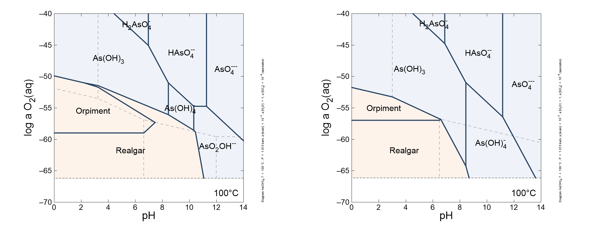

<!-- https://gomakethings.com/how-to-break-an-image-out-of-its-parent-container-with-css/ -->
<style>
@media (min-width: 700px) {
  .full-width {
    left: 50%;
    margin-left: -50vw;
    margin-right: -50vw;
    max-width: 100vw;
    position: relative;
    right: 50%;
    width: 100vw;
  }
}
@media (min-width: 1020px) {
  .full-width {
    left: 50vw; /* fallback if needed */
    left: calc(50vw - 160px);
    width: 1000px;
    position: relative;
    background-color: #9ecff7;
    padding:10px;
  }
}
</style>

```{r setup, include=FALSE}
library(logKcalc)
library(knitr)
## colorize messages 20171031
## adapted from https://gist.github.com/yihui/2629886#file-knitr-color-msg-rnw
color_block = function(color) {
  function(x, options) sprintf('<pre style="color:%s">%s</pre>', color, x)
}
knit_hooks$set(warning = color_block('magenta'), error = color_block('red'), message = color_block('blue'))
```

#### This vignette shows the results from processing thermo_24elements.tdat.
(That is, a modfied version of GWB's thermo.tdat file reduced to 24 elements.)

First we use `modOBIGT` to add some minerals from SUPCRT92, H2O(g), and antigorite with halved chemical formula to match the one used in thermo.tdat.

```{r modOBIGT}
reset()
modOBIGT(c("addSUPCRT", "steam", "antigorite/2"))
```

Some basis species used in the GWB file are not in the default OBIGT database.
They are added to OBIGT here.
Their thermodynamic parameters are estimated from the log*K* values for their dissociation reactions in a different GWB file where they have been swapped out of the basis.

```{r addOBIGT}
addOBIGT("As(OH)4-")
addOBIGT("Sn++++")
```

Set the file paths and perform the log*K* calculation.
The `maxprint` argument is used to prevent the printing of long lists of species that can't be found in OBIGT.

```{r logKcalc}
infile <- system.file("extdata/thermo_24elements.tdat", package = "logKcalc")
outfile <- file.path(tempdir(), "thermo_OBIGT.tdat")
logKcalc(infile, outfile, maxprint = 10)
```

#### Now we can make some plots to compare the logK values in the input and output files.

Labels are added to points with a difference of greater that 1 log*K* unit.

```{r logKcomp, message = FALSE, results = "hide", fig.width = 12, fig.height = 6, out.width = "100%", out.extra='class="full-width"'}
plot1 <- logKcomp(infile, outfile, lab2 = "OBIGT")
plot2 <- logKcomp(infile, outfile, type = "mineral", lab2 = "OBIGT")
gridExtra::grid.arrange(plot1, plot2, ncol = 2)
```

These plots were made with **logKcalc** version `r packageDescription("logKcalc")$Version` and **CHNOSZ** version `r packageDescription("CHNOSZ")$Version`.

#### Now let's see two plots made with Act2 in GWB.

These plots were made with the Mosaic.ac2 script in GWB.
The plot on the left is made with the default thermodynamic data file (thermo.tdat), and the plot on the right is made using the file created by `logKcalc` (thermo_OBIGT.tdat).

```{r Act2, echo = FALSE, out.width = "100%", out.extra='class="full-width"'}

```
