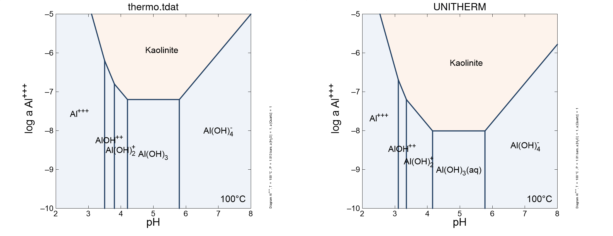

<style>
/* https://gomakethings.com/how-to-break-an-image-out-of-its-parent-container-with-css/ */
@media (min-width: 700px) {
  .full-width {
    left: 50%;
    margin-left: -50vw;
    margin-right: -50vw;
    max-width: 100vw;
    position: relative;
    right: 50%;
    width: 100vw;
  }
}
@media (min-width: 1020px) {
  .full-width {
    left: 50vw; /* fallback if needed */
    left: calc(50vw - 160px);
    width: 1000px;
    position: relative;
    background-color: #9ecff7;
    padding:10px;
  }
}
/* zero margin around pre blocks (looks more like R console output) */
pre {
  margin-top: 0;
  margin-bottom: 0;
}
</style>

<script>
function myFunction() {
  // https://www.w3schools.com/howto/howto_js_toggle_hide_show.asp
  var x = document.getElementById("myDIV");
  if (x.style.display === "none") {
    x.style.display = "block";
  } else {
    x.style.display = "none";
  }
  // https://stackoverflow.com/questions/10671174/changing-button-text-onclick
  // https://stackoverflow.com/questions/7035842/how-to-change-the-buttons-text-using-javascript
  var elem = document.getElementById("myButton");
  if (elem.innerText=="Hide results") elem.innerText = "Show results";
  else elem.innerText = "Hide results";
}
</script>

```{r setup, include=FALSE}
library(logKcalc)
library(knitr)
## colorize messages 20171031
## adapted from https://gist.github.com/yihui/2629886#file-knitr-color-msg-rnw
color_block = function(color) {
  function(x, options) sprintf('<pre style="color:%s">%s</pre>', color, x)
}
knit_hooks$set(warning = color_block('magenta'), error = color_block('red'), message = color_block('blue'))
## use pngquant to optimize PNG images
knit_hooks$set(pngquant = hook_pngquant)
pngquant <- "--speed=1 --quality=0-25"
if (!nzchar(Sys.which("pngquant"))) pngquant <- NULL 
## logK with a thin space 20200627
logK <- "log&thinsp;<i>K</i>"
```

This vignette was compiled on `r Sys.Date()` with **logKcalc** `r packageDescription("logKcalc")$Version` and **CHNOSZ** `r packageDescription("CHNOSZ")$Version`.

#### These plots compare the \logK values in thermodynamic data files from GWB and K2GWB.

Here we use the `logKcomp` function to compare equilibrium constants from the `thermo.tdat` file distributed with The Geochemist's Workbench® and a data file created using K2GWB [@CB05], which is based on the UNITHERM database in the HCh package [@SB99].
The file `ThermoGWB_15_6_2020.tdat` was created using K2GWB for a system with 24 elements (Ag, Al, As, Au, C, Ca, Cl, Cu, F, Fe, H, K, Mg, Mn, N, Na, O, P, Pb, S, Si, Sn, U, Zn).

`logKcomp` reads the reaction coefficients and `r logK` values from two GWB thermodynamic data files and only considers species with the same dissociation reactions in both files.
To make sure the files have identical dissociation reactions for each species in common, the TEdit program in GWB was used to modify the original `thermo.tdat` data file to have the same basis species as the K2GWB file and to remove all redox couples; the system was also reduced to have the same 24 elements.
The result is the file `thermo_24noredox.tdat`.

One or more types of species (redox, aqueous, mineral, or gas) can be selected for comparison; here we choose minerals.

```{r logKcomp1-1, eval = FALSE}
file1 <- system.file("extdata/thermo_24noredox.tdat", package = "logKcalc")
file2 <- system.file("extdata/ThermoGWB_15_6_2020.tdat", package = "logKcalc")
lab1 <- "thermo.tdat"
lab2 <- "UNITHERM"
plot1 <- logKcomp(file1, file2, "mineral", 2, lab1, lab2, c(-25, 150), c(-7, 5))
```

<button id="myButton" onclick="myFunction()">Show results</button>
<div id="myDIV" style="display: none">
```{r logKcomp1-1, echo = FALSE}
```
</div>

The first plot is for 2nd *T*,*P* pair (25 °C); now we make a second plot for the 8th *T*,*P* pair (300 °C).
The plot titles indicate how many of the species have `r logK` values that are not available (NA) at a particular temperature and pressure (indicated by a "500" in the GWB file).

```{r logKcomp1-2, message = FALSE, results = "hide", fig.width = 12, fig.height = 6, out.width = "100%", out.extra='class="full-width"', pngquant = pngquant}
plot2 <- logKcomp(file1, file2, "mineral", 8, lab1, lab2, c(NA, 75))
gridExtra::grid.arrange(plot1, plot2, ncol = 2)
```

The function adds labels to points with a difference of greater than 1 `r logK` unit.
The coordinates are manually adjusted to exclude some points at extreme values, but no labels are lost; the line segments show the locations of the points off the scale.

The plots reveal systematic differences between the databases: most of the large differences correspond to lower `r logK` values for the mineral dissociation reactions in UNITHERM than in `thermo.tdat`
These differences might be associated with different estimation algorithms for thermodynamic parameters that are used in the databases.

A lower `r logK` for dissociation reactions of minerals is reflected in greater stability of the minerals.
An example is the larger stability field for kaolinite in the solubility diagram made using the UNITHERM database (i.e., the `ThermoGWB_15_6_2020.tdat` data file prepared by K2GWB).
The diagrams were made with [this script](Solubility100.ac2), which is adapted from the `Solubility.ac2` example for the Act2 program in GWB.

```{r Act2, echo = FALSE, out.width = "100%", out.extra='class="full-width"'}

```

#### Here are some recommended commands for converting the K2GWB data file using the [OBIGT database](../../CHNOSZ/doc/OBIGT.html) in CHNOSZ.

The `modOBIGT` command adds more minerals from the SUPCRT92 database, an entry for steam that has been removed from OBIGT, and a modified version of realgar to match the chemical formula used in UNITHERM.

```{r logKcalc, eval = FALSE}
infile <- system.file("extdata/ThermoGWB_15_6_2020.tdat", package = "logKcalc")
outfile <- file.path(tempdir(), "ThermoGWB_OBIGT.tdat")
reset()
modOBIGT(c("addSUPCRT", "steam", "realgar*4"))
logKcalc(infile, outfile)
```

See the [next vignette](vig2.html) for the conversion of a file derived from `thermo.tdat`.

## References
