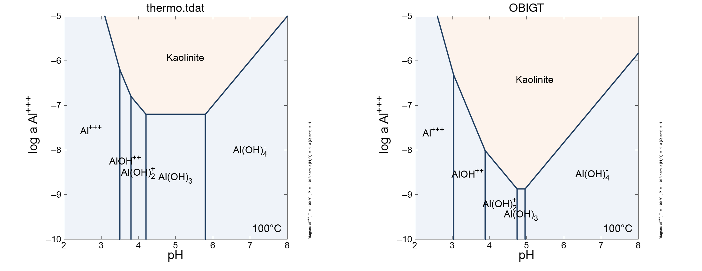

<style>
/* https://gomakethings.com/how-to-break-an-image-out-of-its-parent-container-with-css/ */
@media (min-width: 700px) {
  .full-width {
    left: 50%;
    margin-left: -50vw;
    margin-right: -50vw;
    max-width: 100vw;
    position: relative;
    right: 50%;
    width: 100vw;
  }
}
@media (min-width: 1020px) {
  .full-width {
    left: 50vw; /* fallback if needed */
    left: calc(50vw - 160px);
    width: 1000px;
    position: relative;
    background-color: #9ecff7;
    padding:10px;
  }
}
/* zero margin around pre blocks (looks more like R console output) */
pre {
  margin-top: 0;
  margin-bottom: 0;
}
</style>

<script>
function myFunction() {
  // https://www.w3schools.com/howto/howto_js_toggle_hide_show.asp
  var x = document.getElementById("myDIV");
  if (x.style.display === "none") {
    x.style.display = "block";
  } else {
    x.style.display = "none";
  }
  // https://stackoverflow.com/questions/10671174/changing-button-text-onclick
  // https://stackoverflow.com/questions/7035842/how-to-change-the-buttons-text-using-javascript
  var elem = document.getElementById("myButton");
  if (elem.innerText=="Hide results") elem.innerText = "Show results";
  else elem.innerText = "Hide results";
}
</script>

```{r setup, include=FALSE}
library(logKcalc)
library(knitr)
## colorize messages 20171031
## adapted from https://gist.github.com/yihui/2629886#file-knitr-color-msg-rnw
color_block = function(color) {
  function(x, options) sprintf('<pre style="color:%s">%s</pre>', color, x)
}
knit_hooks$set(warning = color_block('magenta'), error = color_block('red'), message = color_block('blue'))
## use pngquant to optimize PNG images
knit_hooks$set(pngquant = hook_pngquant)
pngquant <- "--speed=1 --quality=0-25"
if (!nzchar(Sys.which("pngquant"))) pngquant <- NULL 
## logK with a thin space 20200627
logK <- "log&thinsp;<i>K</i>"
```

#### This vignette shows how to update a GWB thermodynamic data file using `r logK` values computed with the [OBIGT database](../../CHNOSZ/doc/OBIGT.html) in CHNOSZ.

This vignette was compiled on `r Sys.Date()` with **logKcalc** `r packageDescription("logKcalc")$Version` and **CHNOSZ** `r packageDescription("CHNOSZ")$Version`.

The `logKcalc` function updates the equilibrium constants for species in a GWB data file.
In this example, we convert `thermo_24elements.tdat`, which is a modfied version of GWB's `thermo.tdat` file reduced to 24 elements (Ag, Al, As, Au, C, Ca, Cl, Cu, F, Fe, H, K, Mg, Mn, N, Na, O, P, Pb, S, Si, Sn, U, Zn, the same as in the [previous vignette](vig1.html)).
Some species in the GWB data file may not be present in the default OBIGT database, but [optional databases](../../CHNOSZ/doc/OBIGT.html#optional-DEW) in CHNOSZ can also be used.
Here, we use `modOBIGT()` to add some minerals from SUPCRT92, an entry for steam that has been removed from OBIGT, and antigorite with a chemical formula to match the one used in thermo.tdat.

```{r modOBIGT, message = FALSE}
reset()
modOBIGT(c("addSUPCRT", "steam", "antigorite/2"))
```

Some basis species used in the GWB file are not in the default OBIGT database.
They can be added to OBIGT by fitting their thermodynamic parameters (Δ*G*°, *S*° and *C~p~*°) to the `r logK` values for their dissociation reactions from a different GWB file where they have been swapped out of the basis.

```{r addOBIGT, message = FALSE}
addOBIGT("As(OH)4-")
addOBIGT("Sn++++")
```

Here we set the file paths and perform the `r logK` calculation.
The `maxprint` argument is used to prevent the printing of long lists of species that can't be found in OBIGT.

```{r logKcalc, eval = FALSE}
infile <- system.file("extdata/thermo_24elements.tdat", package = "logKcalc")
outfile <- file.path(tempdir(), "thermo_OBIGT.tdat")
logKcalc(infile, outfile, maxprint = 10)
```

<button id="myButton" onclick="myFunction()">Show results</button>
<div id="myDIV" style="display: none">
```{r logKcalc, echo = FALSE}
```
</div>

Note that species are removed if their `r logK` values are all NA.
This includes a few minerals taken from SUPCRT92, as well as pyrrhotite, whose chemical formula in the GWB file (Fe.875S) is different from that in OBIGT (FeS).

#### Now we can make some plots to compare the `r logK` values in the input and output files.

Only species with the same name and dissociation reaction in both files are considered for the plot.
The plot titles indicate how many of these species have `r logK` values that are not available (NA) at this particular temperature and pressure (indicated by a "500" in the GWB file).
Labels are added to points with a difference of greater than 1 `r logK` unit.

```{r logKcomp, message = FALSE, results = "hide", fig.width = 12, fig.height = 6, out.width = "100%", out.extra='class="full-width"', pngquant = pngquant}
lab1 <- "thermo.tdat"
lab2 <- "OBIGT"
plot1 <- logKcomp(infile, outfile, "aqueous", 4, lab1, lab2)
plot2 <- logKcomp(infile, outfile, "mineral", 4, lab1, lab2, c(-50, 100), c(NA, 5))
gridExtra::grid.arrange(plot1, plot2, ncol = 2)
```

OBIGT has generally lower `r logK` values for dissociation reactions of minerals, which is similar to the case for the [UNITHERM](vig1.html) database.
We also find a larger stability field for kaolinite in the [solubility diagram](Solubility100.ac2) made using `thermo_OBIGT.tdat` compared to the default `thermo.tdat` in GWB.

```{r Act2, echo = FALSE, out.width = "100%", out.extra='class="full-width"'}

```

See the [next vignette](vig3.html) for an example of adding new species to the GWB thermodynamic data file.
