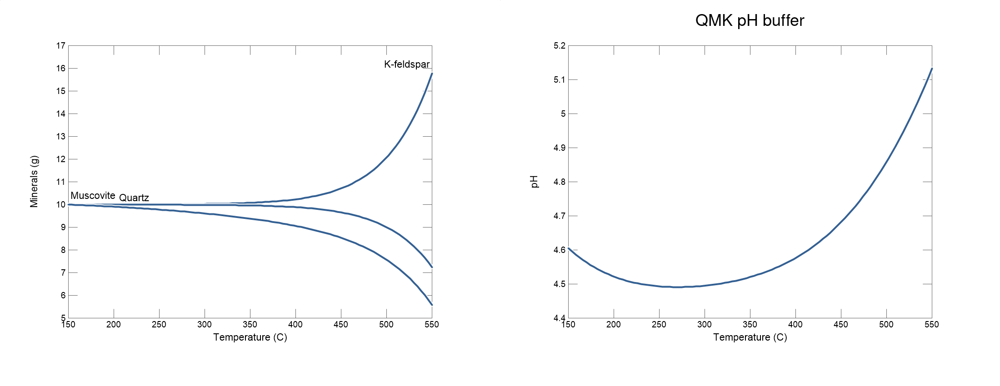
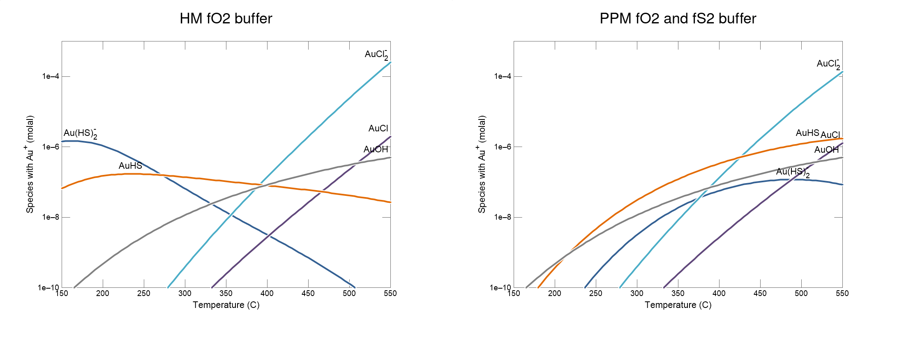

<!-- https://gomakethings.com/how-to-break-an-image-out-of-its-parent-container-with-css/ -->
<style>
@media (min-width: 700px) {
  .full-width {
    left: 50%;
    margin-left: -50vw;
    margin-right: -50vw;
    max-width: 100vw;
    position: relative;
    right: 50%;
    width: 100vw;
  }
}
@media (min-width: 1020px) {
  .full-width {
    left: 50vw; /* fallback if needed */
    left: calc(50vw - 160px);
    width: 1000px;
    position: relative;
    background-color: #9ecff7;
    padding:10px;
  }
}
</style>
<script>
function myFunction() {
  // https://www.w3schools.com/howto/howto_js_toggle_hide_show.asp
  var x = document.getElementById("myDIV");
  if (x.style.display === "none") {
    x.style.display = "block";
  } else {
    x.style.display = "none";
  }
  // https://stackoverflow.com/questions/10671174/changing-button-text-onclick
  // https://stackoverflow.com/questions/7035842/how-to-change-the-buttons-text-using-javascript
  var elem = document.getElementById("myButton");
  if (elem.innerText=="Hide results") elem.innerText = "Show results";
  else elem.innerText = "Hide results";
}
</script>

```{r setup, include=FALSE}
library(logKcalc)
library(knitr)
## colorize messages 20171031
## adapted from https://gist.github.com/yihui/2629886#file-knitr-color-msg-rnw
color_block = function(color) {
  function(x, options) sprintf('<pre style="color:%s">%s</pre>', color, x)
}
knit_hooks$set(warning = color_block('magenta'), error = color_block('red'), message = color_block('blue'))
## use pngquant to optimize PNG images
knit_hooks$set(pngquant = hook_pngquant)
pngquant <- "--speed=1 --quality=0-25"
if (!nzchar(Sys.which("pngquant"))) pngquant <- NULL 
## logK with a thin space 20200627
logK <- "log&thinsp;<i>K</i>"
```

#### This vignette shows a worked example for gold speciation diagrams.

This vignette was compiled with **logKcalc** `r packageDescription("logKcalc")$Version` and **CHNOSZ** `r packageDescription("CHNOSZ")$Version`.

To calculate the speciation and solubility of gold in hydrothermal solutions requires data over a large temperature range (e.g. 150--600 °C) for hydroxide, chloride, and sulfide complexes with Au [@WBM09].
Here we add these species to a GWB thermodynamic data file and change the temperature and pressure for `r logK` calculations.

The thermodynamic system is defined by `thermo_12elements.tdat`, which is a modfied version of GWB's `thermo.tdat` file reduced to 12 elements (Al, Au, C, Cl, Fe, H, K, N, Na, O, S, and Si).
As described in the [previous vignette](vig2.html), we start by using `modOBIGT` to include data for steam and additional minerals from SUPCRT92 that are not in the default database.
If you want to use the SUPCRT92 versions of data for quartz, muscovite, and K-feldspar (and other minerals), use the command with `"noBerman"` instead.

```{r modOBIGT, message = FALSE}
reset()
modOBIGT(c("addSUPCRT", "steam"))
# modOBIGT(c("noBerman", "allSUPCRT", "steam"))
```

The `ispecies` argument can be used to identify other species from OBIGT that should be added to the output.
Their dissociation reactions are written in terms of the available basis species in the GWB file.
This example adds pyrrhotite and some aqueous Au complexes.
Note that the input GWB file also has AuCl~2~^-^ and AuCl~4~^-^; the `r logK` values for the former are recalculated for the given *T* and *P*, but the latter is excluded from the output because it is not available in OBIGT.

```{r ispecies, message = FALSE}
ispecies <- info(c("pyrrhotite", "AuCl", "AuOH", "AuHS", "Au(HS)2-"))
```

This sets up the temperature (8 equally-spaced values from 150 to 500 °C) and pressure (1000 bar)

```{r TP, message = FALSE}
T <- round(seq(150, 550, length.out = 8))
P <- 1000
```

Now we perform the conversion.

```{r logKcalc, eval = FALSE}
infile <- system.file("extdata/thermo_12elements.tdat", package = "logKcalc")
outfile <- file.path(tempdir(), "logKcalc_vig3.tdat")
logKcalc(infile, outfile, T = T, P = P, ispecies = ispecies, maxprint = 10)
```

<button id="myButton" onclick="myFunction()">Show results</button>
<div id="myDIV" style="display: none">
```{r logKcalc, echo = FALSE}
```
</div>

Because it has a different chemical formula in the GWB file and in OBIGT, pyrrhotite is initially removed from the system.
However, by listing it in `ispecies`, it is subsequently added with a dissociation reaction corresponding to its chemical formula and thermodynamic properties from OBIGT.

#### Scripts and output of GWB runs.

Figure 2 of @WBM09 shows two speciation diagrams for Au as a function of temperature.
Both diagrams are made for a solution with 1.5 m NaCl and 0.5 m KCl; the ratio *a*~K^+^~/*a*~H^+^~ (and therefore pH for a given activity of K^+^) is set by the quartz--muscovite--K-feldspar (QMK) buffer.
To perform the buffer calculation in GWB, we run [this script](QMK.rea) for the React program, which uses the thermodynamic data file created above.
The first plot below shows that the minerals in the buffer are supersaturated (i.e., remain in excess) at all temperatures; the second plot shows the values of pH in the QMK buffer with an initial molality of K^+^ equal to 0.5.

```{r QMK, echo = FALSE, out.width = "100%", out.extra='class="full-width"'}

```

Based on this plot, we choose pH = 4.7 as a representative value to make the following diagrams.
The [React script for the first diagram](Au_HM_pH4.7.rea) sets up the hematite--magnetite (HM) oxygen fugacity (*f*O~2~) buffer and adds 0.01 mol S to the system.
The [React script for the second diagram](Au_PPM_pH4.7.rea) sets up the pyrite--pyrrhotite--magnetite (PPM) buffer, which defines both *f*O~2~ and sulfur fugacity (*f*S~2~).
The mineral abundances are chosen so that all of the minerals in the buffers are supersaturated at all temperatures; for the HM calculation the formation of pyrite and pyrrhotite is suppressed.

```{r Au, echo = FALSE, out.width = "100%", out.extra='class="full-width"'}

```

## References
