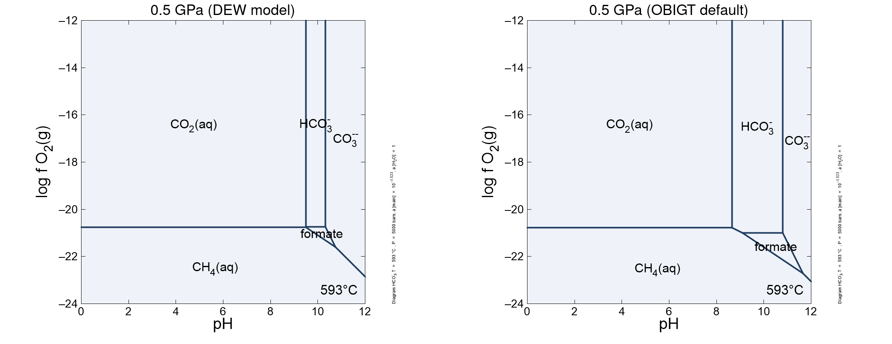
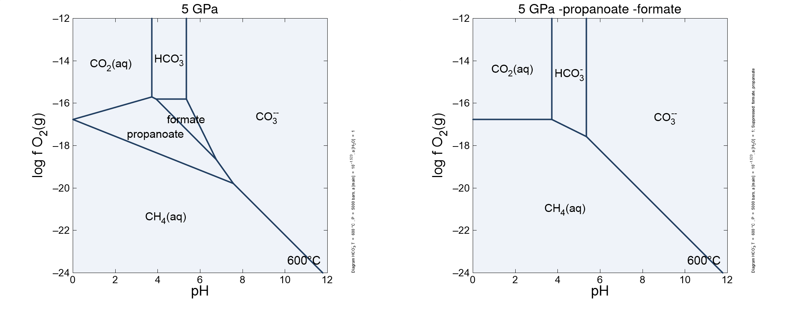

<!-- https://gomakethings.com/how-to-break-an-image-out-of-its-parent-container-with-css/ -->
<style>
@media (min-width: 700px) {
  .full-width {
    left: 50%;
    margin-left: -50vw;
    margin-right: -50vw;
    max-width: 100vw;
    position: relative;
    right: 50%;
    width: 100vw;
  }
}
@media (min-width: 1020px) {
  .full-width {
    left: 50vw; /* fallback if needed */
    left: calc(50vw - 160px);
    width: 1000px;
    position: relative;
    background-color: #9ecff7;
    padding:10px;
  }
}
</style>
<script>
function myFunction() {
  // https://www.w3schools.com/howto/howto_js_toggle_hide_show.asp
  var x = document.getElementById("myDIV");
  if (x.style.display === "none") {
    x.style.display = "block";
  } else {
    x.style.display = "none";
  }
  // https://stackoverflow.com/questions/10671174/changing-button-text-onclick
  // https://stackoverflow.com/questions/7035842/how-to-change-the-buttons-text-using-javascript
  var elem = document.getElementById("myButton");
  if (elem.innerText=="Hide results") elem.innerText = "Show results";
  else elem.innerText = "Hide results";
}
</script>

```{r setup, include=FALSE}
library(logKcalc)
library(knitr)
## colorize messages 20171031
## adapted from https://gist.github.com/yihui/2629886#file-knitr-color-msg-rnw
color_block = function(color) {
  function(x, options) sprintf('<pre style="color:%s">%s</pre>', color, x)
}
knit_hooks$set(warning = color_block('magenta'), error = color_block('red'), message = color_block('blue'))
## use pngquant to optimize PNG images
knit_hooks$set(pngquant = hook_pngquant)
pngquant <- "--speed=1 --quality=0-25"
if (!nzchar(Sys.which("pngquant"))) pngquant <- NULL 
## logK with a thin space 20200627
logK <- "log&thinsp;<i>K</i>"
```

#### This vignette shows the conversion of a GWB data file to use the Deep Earth Water (DEW) model

This vignette was compiled with **logKcalc** `r packageDescription("logKcalc")$Version` and **CHNOSZ** `r packageDescription("CHNOSZ")$Version`.

The Deep Earth Water (DEW) model includes correlations for H~2~O and revised thermodynamic parameters of aqueous species for estimating thermodynamic properties to pressure of up to 6 GPa [@SHA14].
This model was used to predict a significant stability region for organic ions, such as acetate and propionate, at high pressures corresponding to upper mantle conditions [@SSH14].

Let us use the DEW model in CHNOSZ in order to calculate equilibrium constants for dissociation reactions in a GWB thermodynamic data file.
Separate commands are needed to change the water model and load the parameters of the revised Helgeson-Kirkham-Flowers (HKF) equations for aqueous species that are taken from the [DEW spreadsheet](http://www.dewcommunity.org/resources.html).

```{r DEW, message = FALSE}
reset()
water("DEW")
add.obigt("DEW_aq")
# modOBIGT(c("addSUPCRT", "steam"))
```

Note that other changes to the database to add the properties of steam and minerals from SUPCRT92 [@JOH92] are not needed for this calculation.

The `thermo_12elements.tdat` data file includes aqueous CH~4~, CO~2~, HCO~3~^-^, CO~3~^&#8209;&#8209;^, CH~3~COO^-^ (acetate) and HCH3COO (acetic acid), which will be updated during the conversion.
We can use the `ispecies` argument to add other species from OBIGT, in particular formic and propanoic acid and their anions, which were predicted to be major species by @SSH14.
For completeness, we include other aqueous organic species, although they are not expected to appear in the diagrams.

```{r ispecies, message = FALSE}
major <- c("formic acid", "formate", "propanoic acid", "propanoate")
o1 <- c("benzene", "diglycine", "diketopiperazine")
o2 <- c("ethane", "ethanol", "ethylene")
o3 <- c("glutamate", "glutamic acid", "H-glutarate", "glutaric acid")
o4 <- c("glutamine", "glycine", "glycolate", "glycolic acid")
o5 <- c("H-succinate", "hexane", "isobutane")
o6 <- c("lactate", "lactic acid", "leucine", "methanol")
o7 <- c("propane", "propanol", "toluene", "urea")
ispecies <- info(c(major, o1, o2, o3, o4, o5, o6, o7))
```

In the GWB thermodynamic data files, pressure is not an independent variable, but is expanded in terms of the principal temperatures [@GWB20b].
In order to set up calculations to compare different pressures, we choose a series of closely spaced temperatures that approximate a constant temperature of 600 °C.
The pressures are set to 0.5, 1, 1.5, 2, 2.5, 3, 4, 5 GPa, converted to units of bar.

```{r TP, message = FALSE}
T <- 593:600
P <- c(5000, 10000, 15000, 20000, 25000, 30000, 40000, 50000)
```

Now we perform the conversion.
To calculate the extended term parameter of the Debye-Hückel equation at high pressure [see @MSS13; @Dic19], we use the `bgamma` method.
This does not affect the activity diagrams shown below, but is important for speciation calculations that may be possible with GWB.

```{r logKcalc, eval = FALSE}
infile <- system.file("extdata/thermo_12elements.tdat", package = "logKcalc")
outfile <- file.path(tempdir(), "logKcalc_vig4.tdat")
logKcalc(infile, outfile, T = T, P = P, ispecies = ispecies, DH.method = "bgamma", maxprint = 10)
```

<button id="myButton" onclick="myFunction()">Show results</button>
<div id="myDIV" style="display: none">
```{r logKcalc, echo = FALSE}
```
</div>

#### Scripts and output of GWB runs.

[This script](DEW.ac2) for the Act2 program plots the speciation of carbon as a function of oxygen fugacity (*f*O~2~) and pH.
The activity of HCO~3~^-^ is set to 0.03, which is close to the concentration of carbon in the fluid calculated for a model eclogite at 600 °C and 5 GPa [Supplementary Information of @SSH14].
So as not to exceed the maximum pressure accepted by the Act2 program, the script sets a pressure of 5000 bar.
This pressure affects the water limits and stability fields of gases but not the `r logK` values for reactions between aqueous species, which were calculated for higher pressures as described above.
To make these diagrams, we turn off the water limits and gas and mineral fields in Act2.

The first diagram shows a small stability field for formate at 0.5 GPa (5 kbar).
This field is present both for the DEW model and for the water model from SUPCRT92 [@JOH92] with the default OBIGT database in CHNOSZ, which has parameters of the organic acids from @Sho95.
(The GWB data file was created as shown above except the `water` and `add.obigt` commands were omitted and all pressures were set to 5000 bar, the maximum for the revised HKF equations without the DEW model.)

```{r DEW5, echo = FALSE, out.width = "100%", out.extra='class="full-width"'}

```

The next pair of diagrams is for a pressure of 5 GPa (50 kbar) using the DEW model.
In the first, propanoate and formate are predicted to predominate at some redox and pH conditions.
In the second, the formation of both of these species is suppressed; the diagram shows that no other organic species can predominate at equilibrium.

```{r DEW50, echo = FALSE, out.width = "100%", out.extra='class="full-width"'}

```

The presence of predominance fields for propanoate and formate is consistent with the model shown in Figure 3 of @SSH14, where these species are the most abundant C-bearing species in the fluid at 600 °C.
It is unclear why these species are not present in the log*f*O~2~--pH diagram in Figure 1 of that paper, which instead shows a large predominance field for acetate.
However, it may not be surprising that we have trouble reproducing some results of @SSH14; according to a comment in the DEW spreadsheet the acetate parameters were revised after that publication ("revised January 26th, 2016; new a1 value from complexes and organics correlation").

## References
